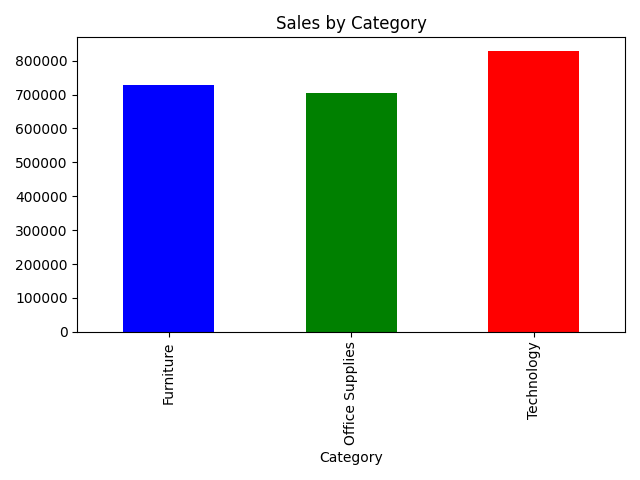
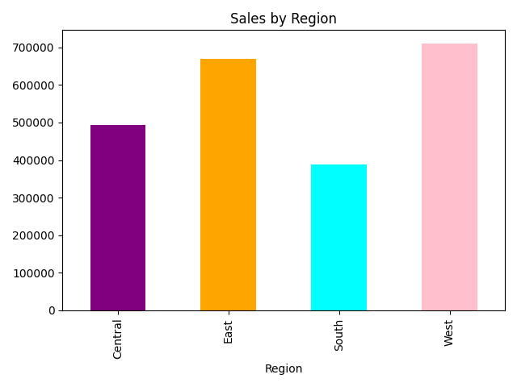
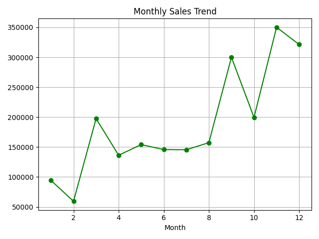

 # 📊 Superstore Sales Analysis

End to End Sales Dashboard built using Python, Pandas, and Matplotlib to analyze retail sales data and uncover key business insights.

## 📌 Project Overview

This project analyzes 9,800+ retail transaction records from a superstore dataset to identify sales trends across categories, regions, and time periods. The goal is to help business stakeholders make data driven decisions.

## 🛠️ Tools & Technologies

- **Python** - Data analysis and processing
- **Pandas** - Data cleaning and manipulation
- **Matplotlib** - Data visualization
- **Jupyter Notebook** - Development environment

## 🔍 Key Findings

- **Technology** is the highest performing category with $827K+ in sales
- **West region** generates the highest revenue at $710K+
- **November** shows peak seasonal sales, likely due to holiday shopping
- **Sean Miller** is the top customer by total purchase value
- No missing values found in critical sales data, indicating clean data collection

## 📈 Visualizations

### Sales by Category

### Sales by Region

### Monthly Sales Trend

## 📁 Dataset

The dataset (`train.csv`) contains 9,800 records with 18 columns including Order ID, Order Date, Customer details, Category, Sub-Category, Sales, and Region information.

## 🚀 How to Run

1. Clone this repository
2. Open `sales_analysis.ipynb` in Jupyter Notebook or VS Code
3. Ensure `train.csv` is in the same folder
4. Run all cells to reproduce the analysis

## 👤 Author

**Vinod Poojari**  
Data Analyst | Python | SQL | Power BI | Excel  
[GitHub](https://github.com/vinodpoojari) 
